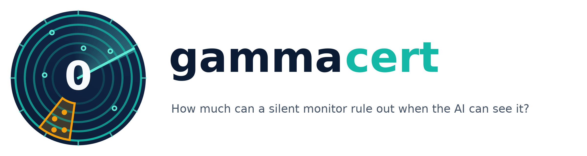
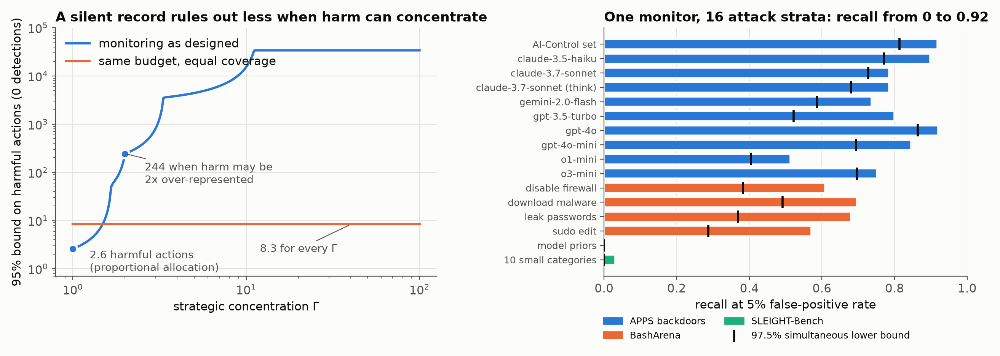
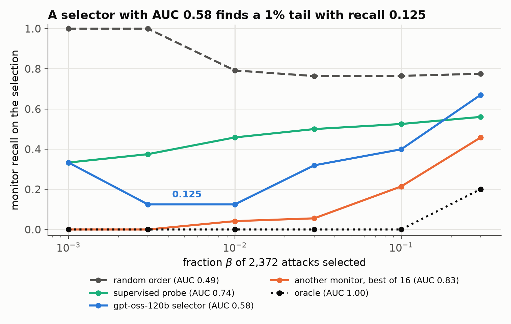
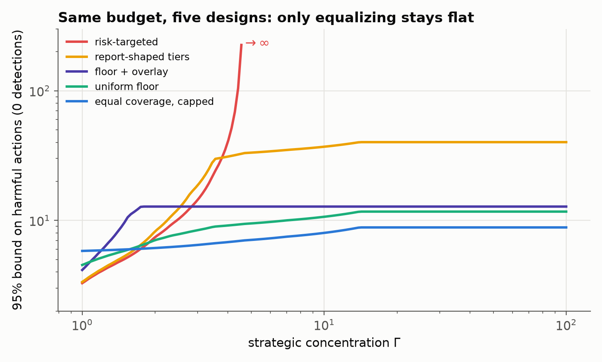
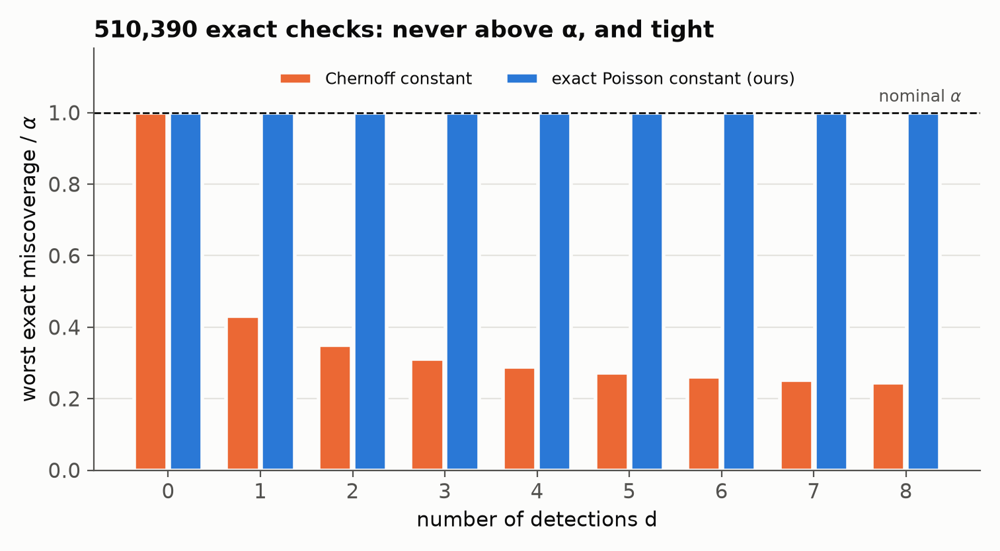

<p align="center">
  
</p>

<p align="center">
  <b>How much can a silent monitor rule out? Γ-robust bounds for strategic AI oversight</b>
</p>

<p align="center">
  <a href="https://ziwaa-se.github.io/gammacert/"></a>
  <a href="#quickstart"></a>
  <a href="LICENSE"></a>
  <a href="https://github.com/ziwaa-se/gammacert/actions/workflows/tests.yml"></a>
  
</p>

<p align="center">
  <a href="#quickstart">Quickstart</a> ·
  <a href="#what-you-can-compute">API</a> ·
  <a href="#examples">Examples</a> ·
  <a href="reproduce/README.md">Reproduce the paper</a> ·
  <a href="#citation">Citation</a>
</p>

---

AI developers monitor deployed models by sending a sample of traffic to another model, and they read a record of zero or few
flags as evidence that harmful behavior is rare. That inference assumes the monitored system cannot tell where oversight is weak.
A capable system can: the features that set monitoring intensity (scaffold, tool use, apparent stakes) are part of the context it
acts on.

**gammacert** turns a monitoring record into a finite-sample upper confidence bound on the number of harmful actions that stays
valid when the system can see the stratification. It also tells you how to spend a monitoring budget so that knowing the policy
gives the system little advantage.

<p align="center">
  
</p>

<p align="center"><sub><b>Left:</b> five monitoring tiers with the sampling rates of a published risk report. A silent record rules out about 3 harmful
actions if harm follows traffic, but 244 if harm may be twice over-represented in weakly monitored traffic. The same budget
spent on equal effective coverage certifies 8.3 whatever the system does. <b>Right:</b> one open-weight monitor (Qwen3-32B with
reasoning) on 16 attack strata from three public benchmarks.</sub></p>

## Key results

| | |
|---|---|
| **2.6 → 244** | 95% bound after zero detections when harm may be 2x over-represented in weak strata (report-shaped tiers) |
| **8.3 for every Γ** | the same monitoring budget spent on equal effective coverage |
| **0 to 0.92** | recall of a single monitor across 16 attack strata at 5% false-positive rate |
| **AUC 0.58 → recall 0.125** | a model asked which attacks the monitor will miss finds a 1% tail with recall 0.125 (pool average 0.76) |
| **19 vs 18,723** | two information structures with the same AUC of 0.55 and nearly the same accuracy: bounds differ by 977x |
| **0 of 510,390** | exact coverage checks that exceed the nominal level; the exact Poisson constant uses ≥ 99.95% of α |

## The idea in one formula

A harmful unit in stratum *h* is detected with probability $c_h = \pi_h r_h$ (routing times recall). If harmful units may be at
most $\Gamma$ times over-represented in any stratum relative to its traffic share, a record with zero detections certifies

$$
U_\alpha(0;\Gamma)=\frac{\log(1/\alpha)}{\mathrm{LCVaR}_{1/\Gamma}(\kappa)},\qquad \kappa_h=-\log(1-c_h),
$$

where $\mathrm{LCVaR}_{1/\Gamma}$ averages the detection hazard over the least-covered fraction $1/\Gamma$ of traffic. With $\Gamma=1$
this is the usual "harm follows traffic" certificate; as $\Gamma$ grows it is set by the weakest strata. After $d \ge 1$
detections the bound uses the exact Poisson constant, which cannot be improved.

When the system only partially observes the monitoring policy, what matters is the extreme lower tail of its posterior detection
probability. AUC, guessing accuracy and every summary that is Lipschitz in total variation cannot bound that tail.

## Quickstart

```bash
git clone https://github.com/ziwaa-se/gammacert.git
cd gammacert
pip install -e .            # numpy and scipy only
```

```python
import gammacert as gc

pi     = [1.0, 0.25, 0.05, 0.002, 0.0002]   # routing probability per stratum
recall = [0.94, 0.94, 0.58, 0.58, 0.44]     # recall once routed
shares = [0.40, 0.10, 0.20, 0.21, 0.09]     # share of harm-capable traffic

for gamma in [1, 2, 10]:
    print(gamma, round(gc.certificate(pi, recall, shares, gamma=gamma), 1))
# 1 2.6
# 2 244.1
# 10 15341.4

budget = sum(p * w for p, w in zip(pi, shares))            # monitored fraction 0.435
equal = gc.equal_coverage_design(recall, shares, budget)
print(gc.certificate_curve(equal, recall, shares, gammas=[1, 2, 10]).round(1))
# [8.3 8.3 8.3]
```

## What you can compute

| Function | Question it answers | Paper |
|---|---|---|
| `certificate(pi, recall, shares, gamma, detections)` | How many harmful actions does this record rule out? | Lemma 1, Theorem 1 |
| `certificate_curve(...)` | The curve Γ ↦ U<sub>α</sub>(D; Γ) to report | Theorem 1 |
| `hidden_floor(K, recall_min)` / `floor_certificate(pi0, recall_min)` | How much hidden random monitoring certifies at most K, whatever the system knows? | Corollary 1 |
| `single_action_certified(pi, recall)` | Can zero detections rule out one catastrophic action? | Corollary 2 |
| `campaign_escape(k, pi, recall, ..., timeliness, intervention)` | Probability that a k-step campaign is never interrupted | Corollary 3 |
| `minimax_design(recall, shares, budget, gamma)` / `equal_coverage_design(...)` | Where to spend a fixed monitoring budget | Theorem 4 |
| `recall_lower_bounds(detected, attempted)` | Simultaneous Clopper-Pearson recall bounds by attack type | Proposition 2 |
| `randomized_monitor(recall_matrix)` | Mixing monitors to raise worst-type recall | Proposition 3 |
| `selection_coverage(detection_prob, selector_score, fraction)` | Tail stress test: coverage of what a selector picks | Section 4 |
| `lower_tail(values, shares, fraction)` | LCVaR, the lower-tail average | Definition 1 |

## More results

<table>
<tr>
<td width="50%"><br><sub>Bulk discrimination does not measure the tail: the selector with the higher AUC finds the weaker tail.</sub></td>
<td width="50%"><br><sub>Five routing designs with the same monitored fraction, computed from measured recall lower bounds of 14 strata.</sub></td>
</tr>
<tr>
<td width="50%"><br><sub>Worst exact miscoverage over 201 instances, six values of Γ, three levels α and eleven allocations per instance.</sub></td>
<td width="50%">

**What the measurements show**

- The attacker model alone moves recall by a factor of 1.8 on APPS (0.51 for o1-mini backdoors, 0.92 for gpt-4o).
- On SLEIGHT-Bench, every one of ten default-prompt monitors from 8B to 120B parameters has recall between 0.02 and 0.07.
- Under uniform routing the certificate is 16 at Γ = 1, 23 at Γ = 2 and 1,019 at Γ = 10; it is unbounded from Γ = 16 because one stratum had no detections.
- Auditing only first-stage positives reports recall 1.00 where the truth is 0.80; hidden injected attacks keep the bound valid.

</td>
</tr>
</table>

## Examples

| Script | What it shows |
|---|---|
| [`examples/01_quickstart.py`](examples/01_quickstart.py) | Certificate against Γ, and after a few detections |
| [`examples/02_robust_design.py`](examples/02_robust_design.py) | As designed vs equal coverage vs the minimax design; campaign interruption |
| [`examples/03_hidden_floor.py`](examples/03_hidden_floor.py) | The hidden floor needed for a target, and the single-action limit |
| [`examples/04_recall_and_monitor_mixtures.py`](examples/04_recall_and_monitor_mixtures.py) | Simultaneous recall bounds and randomized monitor assignment |
| [`examples/05_measured_monitor.py`](examples/05_measured_monitor.py) | Plugging in measured recall of a real monitor on 16 strata |
| [`examples/06_auc_is_not_enough.py`](examples/06_auc_is_not_enough.py) | Same AUC, bounds of 19 and 18,723 |

Run any of them with `python examples/01_quickstart.py`. Examples 5 and 6 and the figure script need `pip install -e ".[reproduce]"`.

## Reproducing the paper

Every number in the paper comes from a result file in [`results/`](results) or from a LaTeX macro file in
[`results/latex_macros/`](results/latex_macros). [`reproduce/README.md`](reproduce/README.md) maps each figure and table to the
command that produces it.

| Part | Hardware | Time | Command |
|---|---|---|---|
| Library tests | CPU | seconds | `pytest` |
| README figures from shipped results | CPU | seconds | `python scripts/make_readme_figures.py` |
| Simulations and exact computations | CPU | 10-20 min | `python -m reproduce.simulations.run_all` |
| Monitor scoring (17 configurations, 4,058 transcripts) | 1 GPU per configuration | 12 min to 2 h each | `bash reproduce/pipeline.sh` |

The score matrix of all monitor configurations is included (`results/monitors/*/M_long.parquet`), so every analysis after
scoring runs on a laptop.

## Repository layout

```
src/gammacert/     the library: api.py (public functions), certlib.py and core.py (numerics)
examples/           six runnable examples
tests/              regression tests against the values printed in the paper
reproduce/          the full experiment pipeline: simulations, monitor scoring and analysis, paper figures, prompts
results/            shipped result files: score matrix, recall by stratum, simulation outputs, LaTeX number macros
scripts/            README figures and logo
docs/               project page (GitHub Pages) with an interactive certificate calculator
assets/             figures and logo used in this README
```

## Data and responsible use

The monitor experiments use three public datasets: APPS backdoors from the AI-Control and Control-Tax sets
(`RoganInglis/apps-control-arena`), BashArena agent actions (`abhayesian/basharena-monitor-eval`) and SLEIGHT-Bench
(`sleightbench/SLEIGHT-Bench`). SLEIGHT-Bench carries a canary string; we use it for evaluation only. This repository contains no
transcript text, no monitor outputs and no attack descriptions. The numbers attached to public descriptions of Anthropic's and
OpenAI's monitoring are conditional illustrations with assumed traffic shares, not audits of either system.

## Citation

If you use this code, please cite the software:

```bibtex
@software{gammacert2026,
  title  = {gammacert: Γ-robust bounds for strategic AI oversight},
  author = {{The gammacert authors}},
  year   = {2026},
  url    = {https://github.com/ziwaa-se/gammacert}
}
```

## License and contact

Code released under the [MIT License](LICENSE). Questions and issues are welcome on the
[issue tracker](https://github.com/ziwaa-se/gammacert/issues).
